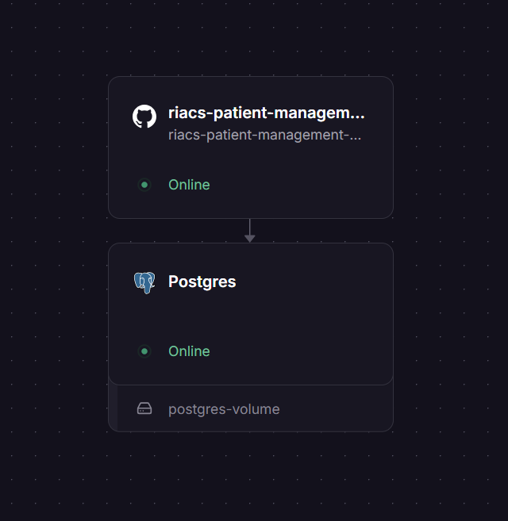

# RIACS Patient Management

Prueba técnica de administración de pacientes con un CRUD completo para crear, consultar, actualizar y eliminar pacientes. El sistema valida los datos en el frontend y en el backend.

## Stack tecnológico

[](https://dotnet.microsoft.com/)
[](https://learn.microsoft.com/ef/core/)
[](https://www.postgresql.org/)
[](https://react.dev/)
[](https://www.typescriptlang.org/)
[](https://vite.dev/)
[](https://www.docker.com/)

- **Backend:** ASP.NET Core sobre .NET 10, con arquitectura en capas.
- **Persistencia:** Entity Framework Core y PostgreSQL mediante Npgsql.
- **Frontend:** React, TypeScript, Vite y Tailwind CSS.
- **Despliegue:** Backend en Railway y frontend en Vercel.

## Mi enfoque de trabajo

Antes de entrar en el detalle técnico, quiero explicar cómo pensé este proyecto y por qué tomé las decisiones que tomé, porque creo que eso dice más de mi forma de trabajar que el código en sí. Esta prueba también fue una oportunidad para aplicar mi conocimientos y ver qué tanto las entiendo cuando las llevo a un proyecto real.

### Por qué arquitectura en capas y no un monolito

Para una prueba técnica de este alcance, perfectamente podría haber resuelto todo en un único proyecto .NET con controladores hablando directo con Entity Framework. Habría sido más rápido de escribir. Decidí **no hacerlo así a propósito**: quería mostrar cómo trabajo en un entorno profesional real, no solo que sé hacer un CRUD funcionar.

Entiendo la importancia de **Clean Architecture** y este proyecto está preparado para llegar a ella con el tiempo disponible que tuve. Por eso separé el backend en **cuatro capas** (`Api`, `Application`, `Domain`, `Infrastructure`), cuidando que cada una tenga una responsabilidad clara y que las dependencias apunten siempre hacia adentro, hacia el dominio:

- **`Backend.Domain`** no depende de nada más. Ahí viven las entidades y los value objects (como `Rut`, que valida su propio formato y dígito verificador). Es el corazón del negocio, y no sabe nada de bases de datos ni de HTTP.
- **`Backend.Application`** define los casos de uso, los DTOs y las interfaces de los repositorios. Sabe *qué* hace el sistema, pero no *cómo* se persiste ni *cómo* se expone.
- **`Backend.Infrastructure`** implementa esas interfaces con Entity Framework Core y PostgreSQL. Si mañana tuviera que cambiar de motor de base de datos, esta es la única capa que debería tocar.
- **`Backend.Api`** es la puerta de entrada: controladores, middleware de excepciones, configuración. No contiene lógica de negocio, solo la orquesta.

Traté de respetar los **principios SOLID** en el camino: responsabilidad única en cada clase, dependencias hacia abstracciones (interfaces de repositorio) en vez de implementaciones concretas, y un middleware centralizado de excepciones para no repetir manejo de errores en cada controlador.

Para que quede más concreto, así se ve esa separación en la práctica dentro de `Backend.Api` y `Backend.Application`:

```text
Backend.Api/
├── Controllers/
│   └── PatientsController.cs
├── Middleware/
│   └── ExceptionHandlingMiddleware.cs
├── appsettings.Development.json
├── appsettings.json
├── Backend.Api.http
└── Program.cs

Backend.Application/
├── Dtos/
│   ├── CreatePatientDto.cs
│   ├── PagedResponseDto.cs
│   ├── PatchPatientDto.cs
│   ├── PatientDto.cs
│   └── UpdatePatientDto.cs
├── Exceptions/
│   ├── PatientNotFoundException.cs
│   └── RutAlreadyExistsException.cs
├── Patients/
│   ├── IPatientService.cs
│   ├── PatientMapper.cs
│   └── PatientService.cs
└── Repositories/
    └── IPatientRepository.cs
```

**`Controllers/PatientsController.cs`** es intencionalmente delgado. No conoce Entity Framework, no arma queries ni valida reglas de negocio: solo recibe la petición HTTP, la delega a `IPatientService` y traduce el resultado a un código de estado adecuado (`200 OK`, `201 Created` con `CreatedAtAction`, `204 No Content`). Todo el trabajo real vive un nivel más abajo, en la capa de aplicación.

**`Dtos/`** existe para no exponer nunca las entidades de dominio directamente por HTTP. `CreatePatientDto`, `UpdatePatientDto` y `PatchPatientDto` definen exactamente qué puede entrar según la operación (por ejemplo, un `PATCH` no debería exigir los mismos campos obligatorios que un `POST`), y `PatientDto` define exactamente qué sale. `PagedResponseDto<T>` envuelve cualquier listado paginado de forma genérica, así que no tuve que duplicar esa estructura para cada recurso.

**`Patients/`** agrupa el caso de uso completo: `IPatientService` es el contrato que el controlador conoce, `PatientService` es la implementación con la lógica real (paginación, orquestación de las excepciones de negocio, delegación al repositorio), y `PatientMapper` se encarga de convertir entre entidad de dominio y DTO, para que esa conversión no quede desperdigada ni repetida en distintos puntos del código.

**`Repositories/IPatientRepository.cs`** es la interfaz que `PatientService` usa para hablar con la persistencia, sin saber que detrás hay PostgreSQL ni Entity Framework. La implementación real vive en `Backend.Infrastructure`, así que `Backend.Application` puede probarse o razonarse sin depender de una base de datos concreta.

**`Exceptions/`** define excepciones de negocio explícitas (`PatientNotFoundException`, `RutAlreadyExistsException`) en vez de devolver `null` o lanzar excepciones genéricas. Eso es lo que permite que **`Middleware/ExceptionHandlingMiddleware.cs`** las intercepte en un solo lugar y las traduzca al código HTTP correcto (`404`, `400`, etc.), sin que cada controlador tenga que preocuparse de ese mapeo.

**CORS** se configura en `Program.cs` con una política nombrada y restringida a los orígenes reales del proyecto (el frontend desplegado y `localhost` de desarrollo), en vez de `AllowAnyOrigin`, justamente para que quedara claro que entiendo el riesgo de dejar la API abierta a cualquier origen en un entorno que después va a producción.

### Por qué arquitectura por módulos en el frontend

En el frontend apliqué el mismo criterio pero con su propio enfoque: **Feature-Based Architecture** (arquitectura por módulos o características) en vez de organizar las carpetas por tipo de archivo.

Me gusta mucho tener el código **organizado y escalable**, y esta forma de estructurar el proyecto trae beneficios concretos que valoro:

- **Cohesión real:** todo lo que tiene que ver con "pacientes" (tabla, modal, diálogo de eliminación, mapper, tipos, validaciones) vive agrupado por su dominio, no disperso entre carpetas genéricas de `components`, `types` y `utils` sin relación visible entre sí.
- **Cambios localizados:** si necesito modificar algo del módulo de pacientes, sé exactamente dónde está todo lo relacionado, y no corro el riesgo de romper otra parte de la aplicación que no tiene nada que ver.
- **Escalabilidad real:** si mañana se agrega un módulo nuevo (por ejemplo, "citas médicas" o "usuarios"), se suma como una unidad nueva sin tener que reorganizar lo que ya existe ni mezclar responsabilidades.
- **Onboarding más simple:** cualquier persona que se una al proyecto puede entender rápido qué hace cada módulo sin tener que rastrear archivos por todo el árbol de carpetas.

Dentro del frontend también cuidé un par de cosas de forma consciente:

- Usé **hooks personalizados siguiendo buenas prácticas** (separación de lógica y presentación, sin efectos secundarios innecesarios, nombres claros de responsabilidad única).
- Separé los **services** del resto de la aplicación, así toda la comunicación con la API vive en un solo lugar y los componentes no saben nada de `fetch` ni de la forma en que está construida la petición.
- Manejé con cuidado los **cuatro estados de los componentes** (carga, éxito, vacío y error), porque una interfaz que solo contempla el "camino feliz" no refleja cómo se comporta una aplicación real: el usuario necesita saber cuándo algo está cargando, cuándo no hay resultados, y cuándo algo falló, no solo ver la tabla cuando todo funciona.

### Sobre el diseño

Para la parte visual me inspiré en la página oficial de [riacs.cl](https://riacs.cl/): me gustó bastante el diseño de la marca y quise aprovechar eso para hacer algo a medida en vez de tirar un CRUD genérico con un componente de UI por defecto. No fue copiar el sitio, sino tomar su línea visual como punto de partida para darle identidad propia a la interfaz.

### Problemas que encontré (y cómo los resolví)

Uno de los problemas más molestos que me encontré fue al **desplegar el backend en Railway**: el build fallaba porque algunos paquetes no eran reconocidos correctamente por diferencias de versión entre mi entorno local y el entorno de build de Railway. En vez de ir ajustando versiones a ciegas hasta que "funcionara en la nube", decidí resolverlo de raíz: **dockericé completamente el backend**. Esto me aseguró que el entorno de build y de ejecución fuera exactamente el mismo en todos lados —local, CI y producción— y eliminó por completo el problema de "en mi máquina sí funciona".

Ya que estaba metido en eso, decidí **dockerizar también el frontend**, no solo el backend. Así el proyecto completo se puede levantar de forma reproducible en cualquier máquina sin depender de tener Node o .NET instalados directamente en el sistema, y de paso quedó como un entregable adicional valorado en la prueba técnica.

## Estructura del proyecto

```text
riacs-patient-management/
├── Backend/
│   ├── src/
│   │   ├── Backend.Api/            # Controllers, middleware y Program.cs
│   │   ├── Backend.Application/    # Casos de uso, DTOs, excepciones e interfaces
│   │   ├── Backend.Domain/         # Entidades, excepciones y value objects
│   │   └── Backend.Infrastructure/ # EF Core, DbContext, migraciones y repositorios
│   ├── Dockerfile
│   ├── .dockerignore
│   ├── Backend.slnx
│   └── railway.json
└── Frontend/
    ├── src/
    │   ├── components/patients/    # Tabla, modal y diálogo de eliminación
    │   ├── components/ui/          # ThemeToggle
    │   ├── mappers/                # Conversión de modelos frontend/backend
    │   ├── pages/                  # PatientsPage
    │   ├── services/               # Cliente HTTP de pacientes
    │   ├── types/                  # Tipos TypeScript
    │   └── validators/             # Validaciones de formularios
    ├── Dockerfile
    ├── .dockerignore
    ├── docker-compose.yml
    ├── .env
    ├── .env.example
    └── vite.config.ts
```

## Requisitos previos

- .NET SDK 10.0 o compatible con el proyecto.
- Node.js y npm.
- PostgreSQL instalado localmente, o Docker para levantar PostgreSQL en un contenedor.
- Docker Desktop o Docker Engine si se desea ejecutar PostgreSQL o el backend en contenedores.
- `dotnet-ef` para ejecutar migraciones desde la línea de comandos:

```bash
dotnet tool install --global dotnet-ef
```

Si ya está instalado, puede actualizarse con:

```bash
dotnet tool update --global dotnet-ef
```

## Ejecución local

### 1. Levantar PostgreSQL

#### Opción A: Docker

```bash
docker run --name postgres-patients \
  -e POSTGRES_PASSWORD=postgres \
  -e POSTGRES_DB=riacs \
  -p 5432:5432 \
  -d postgres
```

Para iniciar nuevamente el contenedor después de detenerlo:

```bash
docker start postgres-patients
```

La cadena de conexión correspondiente es:

```text
Host=localhost;Port=5432;Database=riacs;Username=postgres;Password=postgres
```

#### Opción B: instalación nativa

Instala PostgreSQL desde [postgresql.org](https://www.postgresql.org/download/), inicia el servicio y crea la base de datos:

```bash
createdb -U postgres riacs
```

Usa el usuario, contraseña, host y puerto configurados durante la instalación en `DefaultConnection`.

### 2. Backend

Desde la raíz del repositorio:

```bash
cd Backend
```

Configura `ConnectionStrings:DefaultConnection` en `src/Backend.Api/appsettings.Development.json`. Por ejemplo:

```json
{
  "ConnectionStrings": {
    "DefaultConnection": "Host=localhost;Port=5432;Database=riacs;Username=postgres;Password=postgres"
  }
}
```

Restaura los paquetes y aplica las migraciones:

```bash
dotnet restore
dotnet ef database update \
  --project src/Backend.Infrastructure \
  --startup-project src/Backend.Api
```

Levanta la API:

```bash
dotnet run --project src/Backend.Api
```

Con el perfil HTTP, la API queda disponible por defecto en `http://localhost:5130`. Swagger está disponible en ambiente Development en:

```text
http://localhost:5130/swagger
```

También existe el perfil HTTPS en `https://localhost:7172`. El backend ejecuta migraciones automáticamente solo cuando `ASPNETCORE_ENVIRONMENT=Development`; en producción deben aplicarse manualmente.

### 3. Frontend

En otra terminal, desde la raíz del repositorio:

```bash
cd Frontend
npm install
```

Copia el archivo de ejemplo y configura la URL de la API:

```bash
cp .env.example .env
```

En Windows PowerShell, el equivalente es:

```powershell
Copy-Item .env.example .env
```

Edita `.env`:

```dotenv
VITE_API_URL=http://localhost:5130
```

Inicia el servidor de desarrollo:

```bash
npm run dev
```

Vite mostrará la URL local, normalmente `http://localhost:5173`.

### 4. Ejecutar el backend con Docker

El Dockerfile del backend está en `Backend/src/Dockerfile`. Construye la imagen desde `Backend/src`:

```bash
cd Backend/src
docker build -f Dockerfile -t riacs-backend .
```

Si PostgreSQL está instalado en el host y Docker Desktop está disponible, ejecuta el backend así:

```bash
docker run --name riacs-backend \
  -e ASPNETCORE_ENVIRONMENT=Production \
  -e ConnectionStrings__DefaultConnection="Host=host.docker.internal;Port=5432;Database=riacs;Username=postgres;Password=postgres" \
  -e PORT=8080 \
  -p 8080:8080 \
  riacs-backend
```

En Linux, puede ser necesario usar `--add-host=host.docker.internal:host-gateway` o conectar ambos contenedores a una red Docker. Por ejemplo, con PostgreSQL en un contenedor:

```bash
docker network create riacs-network
docker run --name postgres-patients --network riacs-network \
  -e POSTGRES_PASSWORD=postgres \
  -e POSTGRES_DB=riacs \
  -d postgres
docker run --name riacs-backend --network riacs-network \
  -e ASPNETCORE_ENVIRONMENT=Production \
  -e ConnectionStrings__DefaultConnection="Host=postgres-patients;Port=5432;Database=riacs;Username=postgres;Password=postgres" \
  -e PORT=8080 \
  -p 8080:8080 \
  riacs-backend
```

En producción, aplica las migraciones antes de iniciar la aplicación o como parte del proceso controlado de despliegue. El backend no las ejecuta automáticamente fuera de Development.

### 5. Ejecutar el frontend con Docker

El frontend también está dockerizado. El `Dockerfile` usa un build multi-stage: primero compila el proyecto con Node y luego sirve los archivos estáticos con Nginx, que además incluye fallback a `index.html` para el ruteo de SPA y compresión gzip.

Como las variables `VITE_*` se incrustan en el bundle durante el build, la URL del backend se pasa como build arg:

```bash
cd Frontend
docker build --build-arg VITE_API_URL=http://localhost:5130 -t riacs-frontend .
docker run --rm -p 8080:80 riacs-frontend
```

La aplicación queda disponible en `http://localhost:8080`.

Para desarrollo local con hot-reload, el `docker-compose.yml` monta el código fuente y corre el servidor de Vite en vez del build de producción:

```bash
docker compose up --build
```

Queda disponible en `http://localhost:5173`. Para detenerlo: `docker compose down`.

## Variables de entorno

| Aplicación | Variable | Descripción | Ejemplo |
|---|---|---|---|
| Backend | `ConnectionStrings__DefaultConnection` | Cadena de conexión PostgreSQL usando la configuración jerárquica de .NET. | `Host=localhost;Port=5432;Database=riacs;Username=postgres;Password=postgres` |
| Backend | `ASPNETCORE_ENVIRONMENT` | Ambiente de ejecución. `Development` habilita Swagger y migraciones automáticas. | `Development` |
| Frontend | `VITE_API_URL` | Origen base de la API, sin el sufijo `/api/patients`. | `http://localhost:5130` |

En archivos JSON del backend, la misma cadena se expresa como `ConnectionStrings:DefaultConnection`. No publiques contraseñas reales en el repositorio.

## Endpoints principales

La ruta base es `/api/patients`.

| Método | Ruta | Descripción |
|---|---|---|
| `GET` | `/api/patients?pageNumber=1&pageSize=10&search=` | Obtiene pacientes paginados y permite filtrar por búsqueda. |
| `GET` | `/api/patients/{id}` | Obtiene un paciente por su identificador. |
| `POST` | `/api/patients` | Crea un paciente. |
| `PUT` | `/api/patients/{id}` | Actualiza todos los datos editables de un paciente. |
| `PATCH` | `/api/patients/{id}` | Actualiza parcialmente un paciente. |
| `DELETE` | `/api/patients/{id}` | Elimina un paciente. |

Los campos principales del paciente son nombre, apellido, RUT, fecha de nacimiento, correo y teléfono. Las operaciones de creación y actualización reciben JSON y las operaciones exitosas de actualización y eliminación responden con `204 No Content`.

## Comandos Linux para producción

Esta parte no es mi fuerte todavía, pero me pareció importante no dejarla en blanco. Me puse a ver videos y documentación sobre cómo se administra un servicio en un servidor Linux, y estos son los comandos que entendí bien y con los que me sentí cómodo probando:

Reemplaza `<nombre-del-servicio>` por el nombre real del servicio configurado en el servidor (por ejemplo, el que administra el backend con systemd).

```bash
sudo systemctl restart <nombre-del-servicio>
sudo systemctl status <nombre-del-servicio>
```

`restart` reinicia el servicio, algo que necesitaría hacer después de desplegar una nueva versión o cambiar alguna configuración, y `status` me deja confirmar al toque si quedó corriendo bien o si algo falló al iniciar.

Sé que la prueba menciona también revisar logs, verificar puertos en uso y cambiar permisos, y en mi investigación llegué a ver comandos como `journalctl`, `ss`/`lsof` y `chmod`/`chown` para eso. Preferí no dejarlos documentados aquí como si los dominara, porque todavía no los he usado en un entorno real y no quiero aparentar más experiencia de la que tengo. Es justamente el tipo de cosas que me interesa seguir aprendiendo y reforzar con la práctica.

## Decisiones técnicas (resumen)

- **Arquitectura en capas en el backend:** separa presentación (`Backend.Api`), casos de uso y contratos (`Backend.Application`), reglas de negocio (`Backend.Domain`) y persistencia (`Backend.Infrastructure`), preparando el terreno para Clean Architecture y facilitando probar y cambiar cada responsabilidad de forma independiente.
- **Feature-Based Architecture en el frontend:** el código se organiza por módulo de negocio (pacientes) en vez de por tipo de archivo, priorizando cohesión y escalabilidad.
- **PostgreSQL en todos los ambientes:** mantiene el mismo motor en desarrollo y producción y evita diferencias de comportamiento entre entornos.
- **Value Object `Rut`:** encapsula el formato chileno sin puntos y con guion, además de validar el dígito verificador mediante módulo 11. Un valor válido tiene un formato como `12345678-5`.
- **Middleware de excepciones:** centraliza la respuesta de errores y traduce `InvalidRutException`, `RutAlreadyExistsException` y `PatientNotFoundException` a códigos HTTP apropiados.
- **CORS restringido:** solo permite los orígenes configurados para el frontend desplegado y el desarrollo local; no se habilita cualquier origen.
- **Migraciones controladas:** se aplican automáticamente únicamente en Development. En producción se ejecutan explícitamente para controlar los cambios de esquema.
- **Backend dockerizado por completo:** resuelve de raíz los problemas de compatibilidad de paquetes entre el entorno local y el de despliegue en Railway, garantizando el mismo entorno de ejecución en todos lados.

## Librerías de terceros

| Librería | Uso |
|---|---|
| `Npgsql.EntityFrameworkCore.PostgreSQL` | Proveedor de Entity Framework Core para PostgreSQL. |
| `Microsoft.EntityFrameworkCore` | ORM, `DbContext`, consultas y migraciones. |
| `Microsoft.EntityFrameworkCore.Design` | Herramientas de diseño para generar y aplicar migraciones. |
| `Swashbuckle.AspNetCore` | Generación de documentación Swagger/OpenAPI. |
| `React` y `react-dom` | Construcción de la interfaz de usuario. |
| `Vite` | Servidor de desarrollo y empaquetado del frontend. |
| `TypeScript` | Tipado estático del código del frontend. |
| `Tailwind CSS` | Utilidades de estilos para la interfaz. |
| `react-icons` | Iconos reutilizables en los componentes. |

## Despliegue en producción

- **Frontend:** [https://braduoc-riacs-patient-management.vercel.app/]
- **Backend:** [riacs-patient-management-production.up.railway.app]
- **Base de datos:** PostgreSQL gestionado por Railway.



El frontend debe definir `VITE_API_URL` con la URL pública del backend. El backend debe definir `ConnectionStrings__DefaultConnection` y mantener configurados los orígenes permitidos por CORS para el dominio final del frontend.

